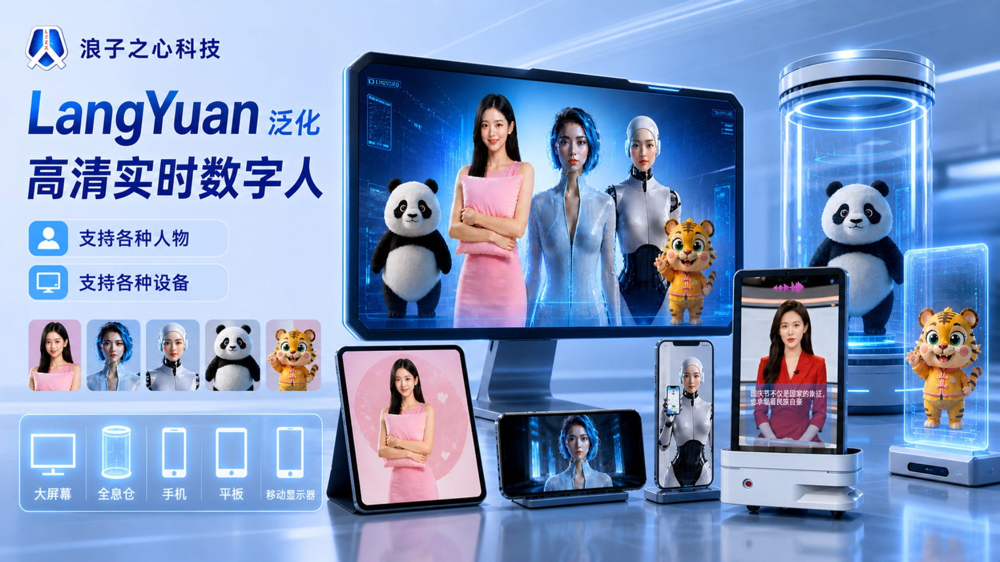
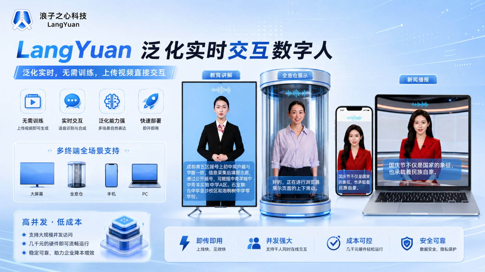
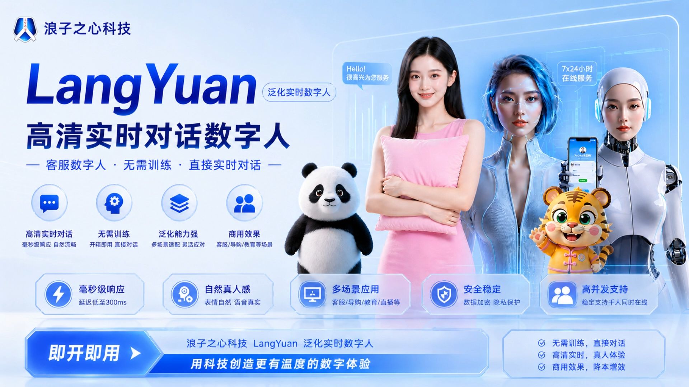
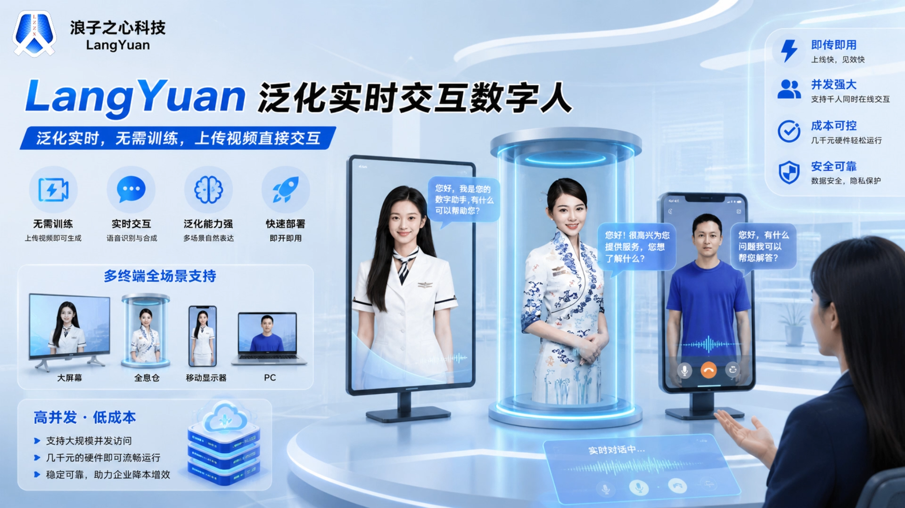
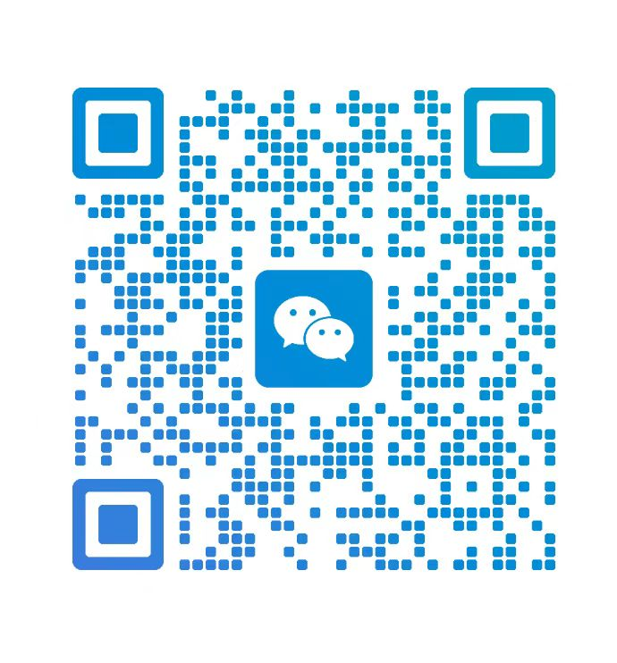

# 🚀 LangYuan
### SOTA Realtime Multimodal Digital Human Platform
### Realtime AI Avatar · Streaming Interaction · WebRTC · Talking Head. LangQing is a realtime interactive digital human platform developed by Langzizhixin Technology. SOTA realtime multimodal digital human platform. 
### 一个超保真还原本人牙齿和嘴型的商用定制实时数字人项目，SOTA级。
## 🏗️ LangQing realtime interactive digital human

  <b>
    <a href="https://www.bilibili.com/video/BV1sbRKBFECa/?spm_id_from=333.1387.upload.video_card.click&vd_source=7720ff9e037156b51374d14ee8f76b51">Video </a>
    |     
    <a href="https://github.com/langzizhixin">Project Page</a>
    |
    <a href="https://github.com/langzizhixin/LangQing">Code</a> 
  </b>

 

## 📊 Project Poster

  
    
  
## 📊 Application Scenarios

  
    
  
## 📊 Technical Solution

  
    

## 📊 Technical Solution

  
    

# 👍  Advantages
1. Only act when speaking, with semantic coordination.
2. It can switch videos seamlessly without any flickering.
3. Commercial algorithms can achieve a similarity of over 96% between teeth and mouth shapes.
4. It can provide an extremely fast response within 500 milliseconds, compared to the average response time of around 1.5 seconds.
5. Support the integration of various intelligent agents.
6. Supports 2D, 2.5D, and 3D.
7. Supports super concurrency. The 3060, priced at over 1000 yuan RMB, supports 4 to 6 concurrent paths.
8. Support cloud deployment, local deployment, and information technology innovation transformation.
9. Support performances such as singing, dancing, and changing clothes.
10. Supports RAG, workflow, and agent orchestration.
11. Low latency and high synchronization, ensuring high synchronization between audio and video lip shape, action, and voice.
12. Supports multiple languages and switching between multiple models.
13. Highly robust automatic speech recognition (ASR) + text-to-speech (TTS).
14. Develop long-term contextual memory ability.
15. It features personalized customization functions.
16. Compliance and Security: Support for private deployment and data isolation to ensure security and reliability.
17. Support seamless integration with mainstream large models.

Wait, these are nationally leading commercial technologies, with no equivalent competing products in China, and currently only second to HeyGen in the United States.

# 🔥 Features
- Ultra low latency realtime interaction (<500ms fast response)
- Natural gesture generation driven by speech semantics
- Seamless video switching without flickering
- High lip-sync accuracy (up to 96% similarity)
- WebRTC realtime streaming
- GPU realtime inference
- Multi-agent integration
- RAG and workflow orchestration
- Singing, dancing and costume changing
- 2D / 2.5D / 3D digital humans
- Human / anime / animal  support
- Cloud deployment and on-premise deployment
- XinChuang compatibility support
- Multi-language support
- Long-context memory
- Persona customization
- High concurrency deployment

## 🎬 Demo

<table class="center">
  <tr style="font-weight: bolder;text-align:center;">
        <td width="50%"><b>  demo   video</b></td>
        <td width="50%"><b>  demo   video</b></td>
  </tr>
  <tr>
    <td>
      <video src=https://github.com/user-attachments/assets/25968397-4e2a-4e42-a35d-4333d233f35a controls preload></video>
    </td>
    <td>
      <video src=https://github.com/user-attachments/assets/2ce620a0-db90-4d9d-8cfd-edaf268deffa controls preload></video>
    </td>
  </tr>
  <tr>
    <td>
      <video src=https://github.com/user-attachments/assets/0f8074fc-8429-4a9f-9dee-a1eb93dc5c4a controls preload></video>
    </td>
    <td>
      <video src=https://github.com/user-attachments/assets/eb78064a-00ef-418f-b3ef-6a8f67769a11 controls preload></video>
    </td>
  <tr>
</table>

## 📖 Disclaimers
This repositories made by langzizhixin from Langzizhixin Technology company 2026.5.13, in Chengdu, China .
For business cooperation, please contact us by email 277504483@qq.com, or add ours WeChat for communication: langzizhixinkeji 

## 📱 商务合作请加微信联系

  
    
